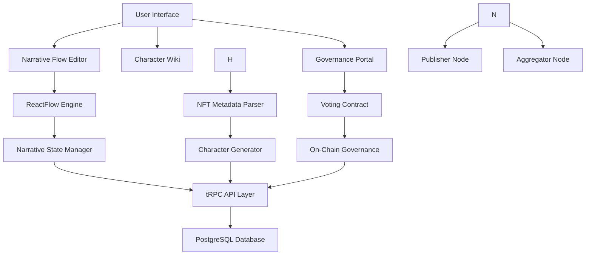

# 🌌 LOAR: Decentralized Narrative Control Suite

<div align="center">


### *Empowering Creators to Build Collaborative Cinematic Universes*

[](https://opensource.org/licenses/MIT)
[](https://www.walrus.xyz/)
[](https://opensea.io)
[](https://www.dynamic.xyz/)

</div>

## 🔮 Vision

LOAR revolutionizes narrative creation by putting the power of storytelling in the hands of communities. Our platform enables collaborative cinematic universe development with decentralized governance, censorship-resistant content hosting, and blockchain-based ownership.

## 🚀 Core Features

### 🧩 Narrative Flow Editor
- **Interactive Graph-Based Editor** - Create and visualize complex narrative structures
- **Character-Plot Connections** - Link characters to storylines with visual relationships
- **Canonicity Management** - Track and vote on official universe canon

### 🛡️ Censorship-Resistant Content (Powered by Walrus Protocol)
- **Decentralized Video Storage** - Content that can't be taken down or censored
- **Trustless Distribution** - No central authority controls your narrative

### 🏛️ Decentralized Governance
- **Token-Based Voting** - Community decides on canonical content
- **Proposal System** - Submit narrative elements for community approval
- **Stake-Weighted Influence** - Greater stake means greater say in universe direction
- **Transparent Decision Making** - All votes recorded on-chain

## 🛠️ Prerequisites

Before you begin, ensure you have the following installed:

- **Node.js** (v18 or higher) - [Download here](https://nodejs.org/)
- **Bun** (recommended) - [Install here](https://bun.sh/)
- **PostgreSQL** - [Install here](https://www.postgresql.org/download/)
- **Foundry** (for smart contracts) - [Install here](https://book.getfoundry.sh/getting-started/installation)
- **Ethereum wallet** (MetaMask recommended)

## 📦 Installation

1. **Clone the repository:**
   ```bash
   git clone <your-repo-url>
   cd Loar-Fullstack
   ```

2. **Install dependencies:**
   ```bash
   # Install dependencies for the entire monorepo
   bun install
   
   # If you encounter missing dependencies, install them specifically for the web app
   cd apps/web
   bun install
   bun add reactflow  # Required for the narrative flow editor
   ```
     ```
3.  **Configure your environment:**
   - Update `apps/server/.env`, refer to apps/server/.env.example
   - Copy `apps/web/.env.example` to `apps/web/.env` and update as needed

4. **Building the application**
```bash 
    #in root directory
    bun run build
    docker compose up -d
``` 

5. **Set up the database:**
   ```bash
   # From the root directory
   bun db:push
   # Or if you prefer to run migrations
   cd apps/server
   bun run db:generate
   bun run db:migrate
   ```

## 🚀 Running the Application

1. **Launch the platform:**
   ```bash
   # Run the full stack:
   bun dev
   
   # Or run just the frontend:
   bun dev:web
   
   # Or run just the backend:
   bun dev:server
   ```

2. **Access the application:**
   - Web App: [http://localhost:3001](http://localhost:3001) or [http://localhost:3002](http://localhost:3002) (port may vary if 3001 is already in use)
   - API endpoints: [http://localhost:3000](http://localhost:3000)

### Troubleshooting

If you encounter dependency issues:

1. **Missing packages**: Some dependencies might not be installed automatically. If you see errors about missing packages, install them individually:
   ```bash
   cd apps/web
   bun add reactflow @tailwindcss/postcss autoprefixer
   ```

2. **Port conflicts**: If port 3001 is already in use, the application will automatically use port 3002 or another available port.

3. **Database connection issues**: Ensure PostgreSQL is running and your connection details in `apps/server/.env` are correct.

4. **Workspace warnings**: You may see warnings about missing workspace directories like "packages/" or "contracts/". These can be safely ignored if you're only working on the web and server applications.

3. **Deploy smart contracts (optional):**
   ```bash
   cd apps/contracts
   forge build
   forge test
   ```

## 🌐 Access the Application

- **Web App:** http://localhost:3001
- **Server:** http://localhost:3000
- **API Documentation:** http://localhost:3000/trpc

- **Multi-Wallet Support** - MetaMask, WalletConnect, Coinbase Wallet, and more

## 📁 Project Structure

```
Loar-Fullstack/
├── apps/
│   ├── web/                 # React frontend with Dynamic auth
│   │   ├── src/
│   │   │   ├── components/
│   │   │   │   ├── flow/       # ReactFlow narrative editor components
│   │   │   │   ├── ui/         # shadcn/ui components
│   │   │   │   └── wiki/       # Character wiki components
│   │   │   ├── lib/          # Utility functions
│   │   │   ├── routes/       # TanStack Router routes
│   │   │   └── utils/        # Helper utilities
│   │   └── public/         # Static assets
│   ├── server/              # tRPC backend
│   │   ├── src/
│   │   │   ├── db/          # Database schema and migrations
│   │   │   ├── routers/      # tRPC route handlers
│   │   │   ├── services/     # Business logic services
│   │   │   └── utils/        # Helper utilities
│   │   └── test/           # Test files
│   ├── character-wiki/      # Character wiki generator
│   └── contracts/           # Solidity smart contracts
├── lib/                     # Shared libraries
└── package.json            # Root package.json
```

## 🌟 Why LOAR? (For Hackathon Judges)

### 💡 The Problem We're Solving
Traditional media creation is centralized, controlled by studios and platforms that can censor content, restrict creator freedom, and limit community involvement. When communities do participate, there's no reliable way to track canonical content or ensure fair governance.

### 🛠️ Our Solution
LOAR creates a decentralized ecosystem where:

1. **Communities Own Their Narratives** - Not corporations or platforms
2. **Content Cannot Be Censored** - Thanks to Filecoin Protocol's decentralized storage
3. **Ownership Is Verifiable** - Through blockchain authentication and NFTs
4. **Governance Is Democratic** - With on-chain voting and proposals
5. **Creation Is Collaborative** - With our visual narrative flow editor

### 💸 Market Potential
- **$300B+** global entertainment market
- **80M+** NFT owners seeking utility for their digital assets
- **Growing demand** for decentralized content platforms resistant to censorship
- **Expanding creator economy** looking for new monetization models

### 📊 Technical Innovation
1. **First-of-its-kind integration** between narrative creation tools and decentralized storage
3. **Unique visual editor** for managing narrative canonicity with blockchain verification
4. **Censorship-resistant media pipeline** from creation to distribution

## 📍 Technical Architecture



### Key Components

1. **Frontend Layer**
   - React 19 with TanStack Router
   - ReactFlow for narrative visualization

2. **API Layer**
   - tRPC for type-safe API calls
   - Hono for high-performance endpoints
   - WebSocket for real-time updates

3. **Storage Layer**
   - PostgreSQL with Drizzle ORM for structured data

4. **Blockchain Layer**
   - Smart contracts for governance


## 🔧 Development

### Adding New Routes
1. Create a new file in `apps/web/src/routes/`
2. Export a `Route` using `createFileRoute`
3. The route will be automatically included

### Adding New API Endpoints
1. Add new procedures in `apps/server/src/routers/`
2. Export them from `apps/server/src/routers/index.ts`
3. Use them in the frontend with tRPC

### Smart Contract Development
1. Add contracts in `apps/contracts/src/`
2. Write tests in `apps/contracts/test/`
3. Deploy scripts in `apps/contracts/script/`

## Filecoin Integration plan
Currently we have our SynapseSDK/WarmStorage implementation in apps/server/src/services/synapse.ts
For the sake of the MVP deployments are currently being handled by a backend service that pays for uploads to filecoin.
However in the future we will explore ways to make uploads to filecoin more economically feasible, using specific providers and CDNs to speed up U/Ds and implementing storage callback methods for better UX.
the two functions we use are synapse.storage.download and synapse.storage.upload.
```

## 🔑 Key Technologies & Technical Implementation

### 🧠 Core Stack
- **TypeScript** - End-to-end type safety across the entire application
- **React 19 & TanStack Router** - Latest React features with optimized routing
- **Hono & tRPC** - High-performance API layer with end-to-end typesafety
- **Tailwind & shadcn/ui** - Beautiful, responsive UI components
- **Drizzle ORM** - Type-safe database access with PostgreSQL

### 🌊 Filecoin Integration
- **Synapse SDK** uploads and downloads handled through funded synapse integration on backend

### 🔗 Blockchain Features
- **Smart Contract Governance** - On-chain voting and proposal systems
- **Token-Gated Access** - Exclusive features for token holders

## 🤝 Contributing

1. Fork the repository
2. Create a feature branch
3. Make your changes
4. Add tests if applicable
5. Submit a pull request

## 🌐 The Future of LOAR

Our roadmap includes:

- **AI-Generated Content** - Narrative expansion using AI models
- **Cross-Universe Collaborations** - Connect multiple cinematic universes
- **Mobile Apps** - Take your universe creation on the go
- **Creator Monetization** - Direct revenue streams for contributors
- **Expanded Blockchain Support** - Integration with more chains and L2s


## 📚 License

This project is licensed under the MIT License.

## 👨‍💻 Team

LOAR was created by a team of passionate developers, designers, and storytellers who believe in the power of decentralized narrative creation.

---

<div align="center">

# 🔥 Decentralize Storytelling. Empower Communities. Build Universes. 🔥

</div>
